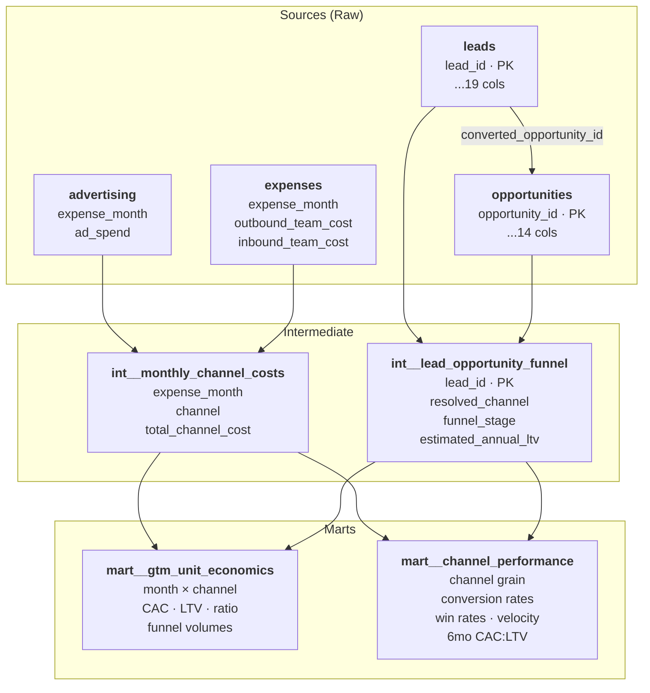

# Owner.com GTM Analytics — dbt Data Product

A dbt project that transforms raw Salesforce and finance data in Snowflake into a single source of truth (SSOT) for Owner.com's Go-To-Market analytics, enabling data-driven decisions on channel allocation, funnel optimization, and CAC:LTV improvement.

---

## Quick Start

```bash
# 1. Install dbt-snowflake
pip install dbt-snowflake

# 2. Configure your profile (~/.dbt/profiles.yml)
#    See "Snowflake Connection" section below

# 3. Verify connection
dbt debug

# 4. Run all models
dbt run

# 5. Run tests
dbt test
```

### Snowflake Connection

Add the following to `~/.dbt/profiles.yml`:

```yaml
owner_gtm:
  target: dev
  outputs:
    dev:
      type: snowflake
      account: gvszsbn-tea10269
      user: <your_user>
      password: <your_password>
      database: demo_db
      schema: gtm_case
      warehouse: case_wh
      role: <your_role>
      threads: 4
```

---

## Project Structure

```
dbt_project/
├── dbt_project.yml                 # Project configuration
├── README.md                       # This file
├── models/
│   ├── staging/                    # Layer 1: Clean raw data
│   │   ├── _stg__sources.yml      #   Source definitions + tests
│   │   ├── _stg__models.yml       #   Model documentation + tests
│   │   ├── stg__leads.sql
│   │   ├── stg__opportunities.sql
│   │   ├── stg__advertising.sql
│   │   └── stg__expenses.sql
│   ├── intermediate/              # Layer 2: Business logic
│   │   ├── _int__models.yml
│   │   ├── int__lead_opportunity_funnel.sql
│   │   └── int__monthly_channel_costs.sql
│   └── marts/                     # Layer 3: Analytical output
│       ├── _mart__models.yml
│       ├── mart__gtm_unit_economics.sql
│       └── mart__channel_performance.sql
└── analysis/
    └── gtm_opportunities_and_recommendations.md
```

---

## Data Model

### Entity Relationship Diagram



### Transformation Layers

| Layer | Purpose | Materialization |
|---|---|---|
| **Staging** | 1:1 with source tables. Cleans data types, fixes date typos, parses currency formats, renames to snake_case. | View |
| **Intermediate** | Joins leads→opportunities, combines cost sources. Resolves channel attribution, computes LTV estimates. | View |
| **Marts** | Final analytical tables. Computes CAC, LTV:CAC ratio, conversion rates at every funnel stage. | Table |

---

## Methodology

### Channel Attribution

Channels are resolved using a two-tier approach:

1. **Opportunity-level** (highest confidence): `how_did_you_hear_about_us` field maps to:
   - `'inbound'`: Facebook/IG, Media Outlet, Youtube, Word of mouth
   - `'outbound'`: Cold call
2. **Lead-level fallback**: If the opportunity has no attribution (`'unknown'`), we infer from the lead:
   - `'inbound'`: `form_submission_date` is populated (prospect submitted an interest form on Owner.com)
   - `'outbound'`: No form submission (prospect was sourced via BDR cold outreach)

**Trade-off**: ~77% of opportunities lack explicit channel attribution. The lead-level inference is a reasonable heuristic — inbound prospects fill out forms, outbound prospects don't — but it may misclassify some referral or organic leads as outbound. Improving CRM data capture upstream would increase attribution accuracy.

### LTV Estimation

```
Estimated Annual LTV = ($500 × 12 months) + (predicted_sales_with_owner × 5% × 12 months)
                     = $6,000 + (predicted_monthly_online_sales × 0.60)
```

- The **$500/month subscription** is fixed revenue per customer.
- The **5% take rate** applies to online sales conducted through Owner.com's product.
- `predicted_sales_with_owner` is treated as a monthly estimate.
- We use a **1-year horizon** as a conservative LTV baseline. In practice, multi-year retention would increase this significantly.

### CAC Calculation

```
CAC = Total Channel Cost / Closed Won Deals

Inbound Cost  = Advertising Spend + Inbound Sales Team (SDR) Salaries
Outbound Cost = Outbound Sales Team (BDR) Salaries
```

Note: AE (Account Executive) costs are shared across both channels and are not included in the provided expense data. The calculated CAC therefore understates the true fully-loaded CAC for both channels proportionally.

### Funnel Stages

```
1_lead_only              → Lead exists but never converted to opportunity
2_open_opportunity       → Converted to opportunity, still in pipeline
3_closed_lost_no_demo    → Lost without a demo being held
4_closed_lost_after_demo → Lost after demo was held
5_closed_won             → Deal won
```

---

## Data Quality Notes

| Issue | Affected Fields | Fix Applied |
|---|---|---|
| Year prefix typo (`0024-` / `0023-`) | `close_date`, `demo_set_date`, `form_submission_date` | `REGEXP_REPLACE(col, '^00', '20')` |
| European number format | `predicted_sales_with_owner` | Replace comma with period, cast to NUMBER |
| European currency format | `advertising`, salary columns | Regex strip non-numeric except comma, then swap comma→period |
| Python list strings | `marketplaces_used`, `cuisine_types`, `online_ordering_used` | Preserved as-is in staging; parse downstream as needed |
| Missing values | `predicted_sales_with_owner` = 'nan' / '0' | Cast to NULL |
| Missing channel attribution | 77% of opportunities | Resolved via lead-level inference fallback |

### Potential Upstream Improvements

1. **Mandatory channel attribution** on opportunity creation in Salesforce — eliminates the need for inference.
2. **Standardize date formats** at the ETL layer before loading into Snowflake.
3. **Normalize array fields** (marketplaces, cuisines) into separate junction tables for easier querying.
4. **Track AE costs** separately to enable fully-loaded CAC calculations.
5. **Add churn/retention data** to compute multi-year LTV instead of a 1-year proxy.

---

## Key Assumptions

1. `predicted_sales_with_owner` represents **monthly** estimated online sales revenue.
2. LTV uses a conservative **1-year horizon** (subscription + take rate).
3. Leads **with** `form_submission_date` are inbound; those **without** are outbound.
4. Expense data covers **Jan–Jun 2024** only; time-series analysis is limited to this window.
5. AE compensation is **not included** in the cost data; CAC is understated for both channels.
6. Currency values use **European formatting** (space = thousands separator, comma = decimal).
